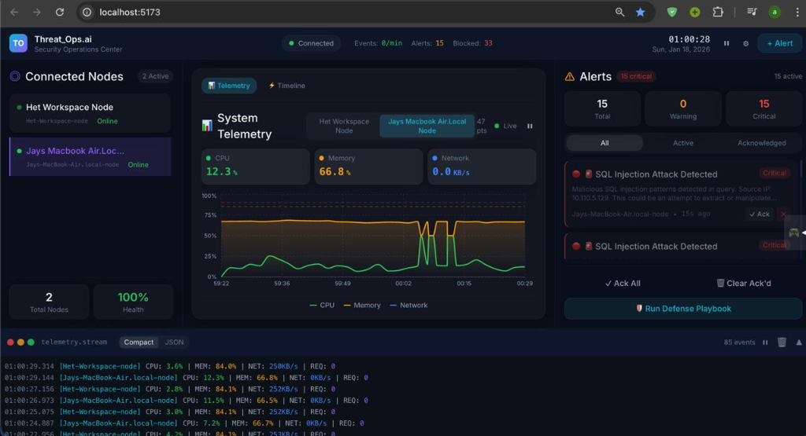
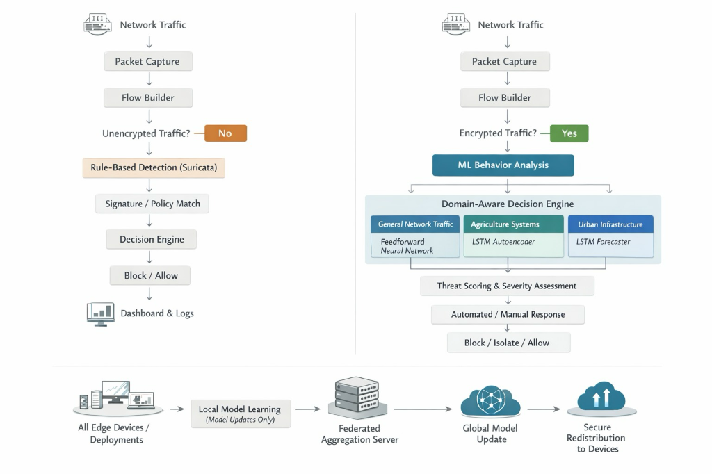
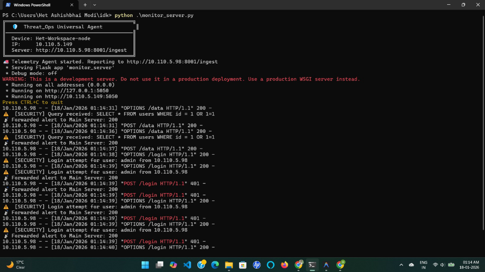
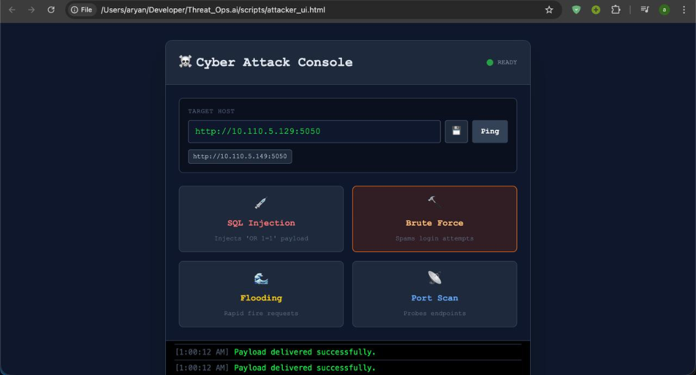

# Threat_Ops.ai 🛡️

**AI-Powered Threat Detection & Automated Response Platform (SOAR)**



Threat_Ops.ai is a comprehensive, microservices-based **Security Orchestration, Automation, and Response (SOAR)** platform. It provides real-time monitoring, AI-driven threat detection, and automated incident response for critical infrastructures (Healthcare, Agriculture, Urban Systems).

---

## 🚀 Key Features

*   **Real-time Monitoring**: Live telemetry (CPU, RAM, Network) from distributed agents.
*   **AI Detection Engine**: Rule-based and anomaly detection for SQLi, DDoS, Brute Force, and more.
*   **Automated Response**: Instantly blocks IPs, isolates compromised services, and alerts SOC teams.
*   **Microservices Architecture**: Scalable, modular design using Python (FastAPI) and Node.js.
*   **Interactive Dashboard**: Beautiful, glassmorphism-inspired UI built with React & Tailwind CSS.
*   **Red Team Tools**: Built-in Attack Simulator and Victim Agent for full-spectrum wargaming.

---

## 🏗️ System Architecture

The system follows a modular microservices architecture, ensuring scalability and isolation.


**How the engine works
**

### Core Components

| Service | Port | Description |
| :--- | :--- | :--- |
| **Frontend** | `5173` | React Dashboard (Vite + Tailwind). Visualizes alerts and telemetry. |
| **API Gateway** | `3001` | Socket.IO bridge. Handles real-time communication between UI and Backend. |
| **Ingest Service** | `8001` | High-throughput entry point for telemetry logs. First line of validation. |
| **Detection Engine** | `8002` | Analyzes events against security rules (SQLi, Port Scan, Abnormal Load). |
| **Alert Manager** | `8003` | Correlates anomalies into human-readable Alerts. Deduplicates noise. |
| **Response Engine** | `8004` | Executes Playbooks (e.g., Block IP, Kill Process) using `psutil`/IPTables. |
| **Model Service** | `5001` | ML-based anomaly detection and attack simulation using trained models. |

---

## ⚡ Quick Start (Local Dev)

Running the entire platform takes just **one command**.

### Prerequisites
*   Node.js (v18+) & npm
*   Python 3.11+
*   Git

### 1. Installation
Clone the repo and install dependencies:
```bash
git clone https://github.com/AryanVadhadiya/Smooth_Operator.git
cd Smooth_Operator
npm install
```

### 2. Backend Setup
Install Python dependencies for all microservices (only needed once):
```bash
# Auto-install for backend microservices
for service in ingest-service api-gateway detection-engine alert-manager response-engine; do
  echo "Installing deps for $service..."
  (cd backend/$service && python3 -m venv venv && source venv/bin/activate && pip install -r requirements.txt)
done

# Install for Model Microservice
echo "Installing deps for model_microservice..."
(cd model_microservice && python3 -m venv venv && source venv/bin/activate && pip install -r requirements.txt)
```

### 3. Launch! 🚀
Start all services (Frontend + 5 Backend Microservices) in parallel:
```bash
npm run dev
```

Visit the **Dashboard** at [**http://localhost:5173**](http://localhost:5173).

---

## 🎮 Wargame Mode: Red Team vs. Blue Team

Turn your setup into a live cyber-range with 3 devices.

### 🔷 Device A: Blue Team (The SOC)
*   **Role**: Security Operations Center.
*   **Action**: Run `npm run dev`. This hosts the backend and dashboard.
*   **View**: Monitor the Dashboard on `localhost:5173`.

### 🔻 Device B: The Victim (Target)
*   **Role**: A server exposing critical services (Healthcare DB, SCADA Controller).
*   **Setup**:
    1.  Copy `systemapp/monitor_server.py` to this machine.
    2.  Run: `python monitor_server.py`.
    3.  Enter Device A's IP when prompted (or configured in script).
*   **Effect**: Streams **REAL** system metrics (CPU, RAM) to the Blue Team dashboard.



### ⚔️ Device C: Red Team (The Attacker)
*   **Role**: External Threat Actor.
*   **Setup**: Open `scripts/attacker_ui.html` in any browser.
*   **Action**:
    1.  Enter Device B's IP address.
    2.  **Launch Attacks**: SQL Injection, Brute Force, or High-Volume DDoS flooding.
    3.  **Config**: Customize concurrency and request count for stress testing.



---

## 🚢 Kubernetes Deployment

Deploy the entire stack to a Kubernetes cluster using the provided scripts and manifests.

### 1. Build & Deploy
```bash
# Build all Docker images
./build-images.sh

# Deploy to Kubernetes (Apply manifests)
./kuber_run.sh
```

### 2. Verify Deployment
```bash
kubectl get pods
kubectl get services
```


The frontend will be available at the NodePort or LoadBalancer IP specified in `k8s/frontend.yaml`.

---

## 🛡️ Capabilities & Defense Logic

### 1. SQL Injection (SQLi)
*   **Attack**: `POST /data` with payload `OR 1=1`.
*   **Detection**: Regex pattern match in `payload` content.
*   **Response**: Immediate **IP Block**.

### 2. DDoS / Flooding
*   **Attack**: High frequency of requests (>100 req/min) from a single source.
*   **Detection**: Rate limiting triggers in `Detection Engine`.
*   **Response**: **Rate Limit** applied + Alert SOC.

### 3. Critical System Load
*   **Trigger**: Agent reports CPU > 90% or RAM > 95%.
*   **Response**: **Service Isolation** (simulated process kill).

---

## 📂 Project Structure

```
Threat_Ops.ai/
├── backend/                   # Microservices
│   ├── api-gateway/           # WebSocket Hub (Port 3001)
│   ├── ingest-service/        # Event Collector (Port 8001)
│   ├── detection-engine/      # Analysis Logic (Port 8002)
│   ├── alert-manager/         # Alert Logic (Port 8003)
│   └── response-engine/       # Active Defense (Port 8004)
├── model_microservice/        # ML Models & Training (Port 5001)
├── frontend/                  # React Dashboard (Port 5173)
├── systemapp/                 # Monitoring Agent
├── k8s/                       # Kubernetes Manifests
├── scripts/                   # Standalone Tools
│   └── attacker_ui.html       # Attack Console (HTML/JS)
├── docs/                      # Documentation & Images
└── arch.md                    # Detailed Architecture Docs
```

---

## 🔮 Future Roadmap

*   [x] **Machine Learning**: ML-based anomaly detection service (Active).
*   [x] **Containerization**: Docker & Kubernetes support (Active).
*   [ ] **Database**: Move from `json` files to `PostgreSQL` + `TimescaleDB`.
*   [ ] **SIEM Integration**: Forward alerts to Splunk/Elastic.

---

**Built with ❤️ for Cyber Security.**
